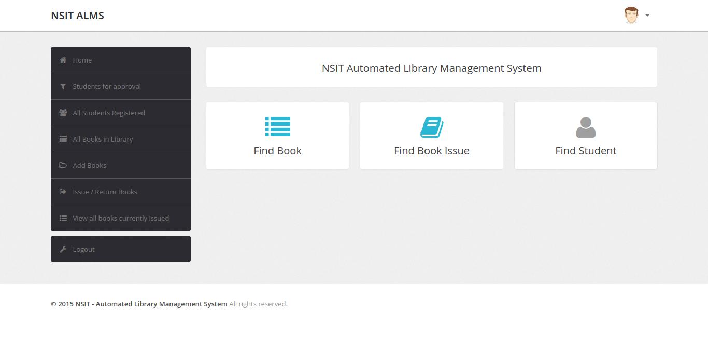

# Library Management System

> An automated system to manage a public library. Admin panel for librarians to control and manage the system easily through an interactive interface.

 + [Development](#development)
 + [Contribute](#contribute)
 + [Setup](#setup)
 + [Features](#features)
 + [Screenshots](meta/README.md)

## Development
The backend of the system is developed on **[Laravel 4.2 PHP MVC Framework](http://laravel.com/)** and requires PHP 5.6 with the appropriate MCrypt extension.
The front end is built on **[Edmin Responsive Bootstrap Admin Template](http://egrappler.com/responsive-bootstrap-admin-template-edmin/)** ([Demo](http://www.egrappler.com/edmin/index.html)) which is built on [Bootstrap v2.2.2](http://bootstrapdocs.com/v2.2.2/docs/) using [jQuery](https://blog.jquery.com/2013/02/04/jquery-1-9-1-released/) and [Underscore-Dot-JS](http://underscorejs.org/)

## Contribute
+ For reporting bug about an incorrect file not being processed, open a new issue.
+ PRs are always welcome to improve exisiting system.

## Setup

### Prerequisite: Install MySQL (for Linux)

> If you don't already have the MySQL Database Server installed, you will need to install it to use this project. If it is installed, you can skip to step 4.

1. Oracle provides detailed instructions to install MySQL on any Linux distribution. See ["Installing MySQL on Linux"](https://dev.mysql.com/doc/refman/8.0/en/linux-installation.html) for details and instructions. 
2. Altneratively, you can probably install a working MySQL server that is compatible with this project by running:

`apt-get update && apt-get install mysql-server`

3. *You may be prompted to choose a root password for MySQL during the installation.*
4. You should [create a MySQL user](https://dev.mysql.com/doc/refman/8.0/en/adding-users.html) for this project, [create a database](https://dev.mysql.com/doc/refman/8.0/en/create-database.html) for this project, and may need to give the mysql user permissions to access the database. Instructions to configure the project are provided below.

### Unix / Linux / Mac Setup

*NOTE:* PHP 5.6, the PHP mcrypt extension, and MySQL are required for this project:

* `apt-get update`

* `apt-get install php5.6 php5.6-mcrypt`

* `git clone https://github.com/prabhakar267/library-management-system`

* `cd library-management-system`

* `[sudo] chmod -R 755 app/storage`

* `composer install`

 * Edit [mysql.config.php.sample](app/config/mysql.config.php.sample) according to your MySQL configurations and save it in the same directory as ```mysql.config.php```

* `php artisan migrate`

* `php artisan serve`

### Windows Setup

*Some notes on Windows setup:*

**MySQL setup**

* Open this link to [Download MySQL Workbench](https://dev.mysql.com/downloads/workbench/).

* Scroll to the bottom and select *Microsoft Windows* in the *Select your Operating System* dropdown.

* Click *download* button in front of *Windows (x86, 64-bit), MSI Installer* at the bottom.

* Right-click the downloaded MSI file and select the Install item from the pop-up menu, or double-click the file.

* In the Setup Type window you may choose a Complete or Custom installation. To use all features of MySQL Workbench choose the Complete option.

* Unless you choose otherwise, MySQL Workbench is installed in `C:\%PROGRAMFILES%\MySQL\MySQL Workbench 8.0 edition_type\`, where `%PROGRAMFILES%` is the default directory for programs for your locale. The `%PROGRAMFILES%` directory is defined as `C:\Program Files\` on most systems.


**PHP Setup**

*Obtaining the `mcrypt` extension for PHP 7+ is not trivial and involves compiling your own PHP build.
If your PHP version does not support `mcrypt` (i.e. if you have PHP 7+), then the easiest way to run Laravel 4.2 applications is to [download a compatible version of XAMPP](https://www.apachefriends.org/xampp-files/5.6.33/xampp-win32-5.6.33-0-VC11-installer.exe) and make sure the app is run with it.*

With the above notes in mind, Windows setup is not too tricky:

* Open git shell;

* `cd C:/path/to/xampp/htdocs`;

* `git clone https://github.com/prabhakar267/library-management-system`;

* `cd library-management-system`;

* `composer update`;

* **NOTE:** If your PHP version is not compatible with `mcrypt` you will receive an error here. Do not worry, simply perform these additional two steps:
 * `C:/path/to/xampp5.6.33/php/php.exe artisan clear-compiled`
 * `C:/path/to/xampp5.6.33/php/php.exe artisan cache:clear`

* Create a table for the app via phpmyadmin (or however you prefer);

* Edit `app/config/mysql.config.php.sample` according to your MySQL configurations and save it in the same directory as `mysql.config.php`;

* `php artisan migrate`

 **OR IF YOUR PHP IS NOT `mcrypt` COMPATIBLE:**

 `C:/path/to/xampp5.6.33/php/php.exe artisan migrate`

* `php artisan serve`

 **OR IF YOUR PHP IS NOT `mcrypt` COMPATIBLE:**

 `C:/path/to/xampp5.6.33/php/php.exe artisan serve`

## Features
 + Librarians can be given their authorized login ID and password without which the system can not be accessed.
 + Students can only access limited features, i.e., public access level features which include **searching a book** and **student registration form**.
 + After logging in librarians can search for a specific book, book issue or student from the home panel.
 + Librarians need to make an entry for new books. To automate the process they simply need to enter the number of issues, then the Issue ID for each book issue is generated automatically.
 + Another responsibility of a librarian is to approve students in situations where approval is needed, i.e. where documents are to be verified or some manual work. Librarians have a panel to simply approve / reject students and to view all approved students. The librarian ID is stored alongside each approved/rejected student to keep track.
 + The most important function of any library is to issue and return books. This system includes a panel to view all outstanding logs and a super simple panel to issue and return books for all librarians.



